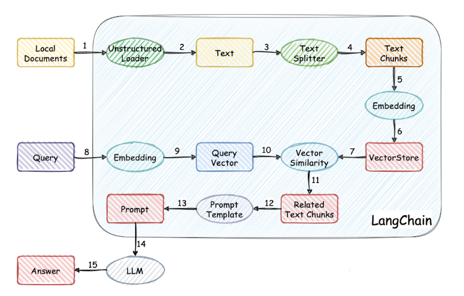
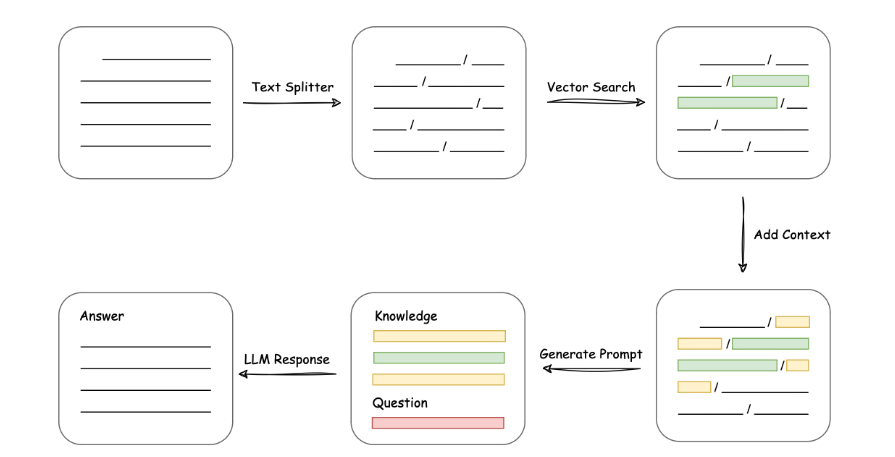

### 实现原理

整个项目的实现过程：


以文档角度理解整个实现过程：


### 0. 安装基础环境

```python
pip install -r requirements.txt
```

### 1. 配置相应参数[model_config.py](./configs/model_config.py) ；

### 2. 运行使用

#### 2.1 以WebUI运行

```python
python webui_demo.py
```

#### 2.2 以CLI运行

```python
python cli_demo.py
```

#### 2.3 以API运行

对文本进行编码并进行测试：
```python
python cli_demo.py
```

修改[api_demo.py](./api_demo.py) 的`vs_path`，然后以API运行使用：
```python
python api_demo.py
```

客户端请求：
```python
python client.py
```

### 参考

1. https://github.com/THUDM/ChatGLM-6B
2. https://github.com/hwchase17/langchain
3. https://github.com/imClumsyPanda/langchain-ChatGLM